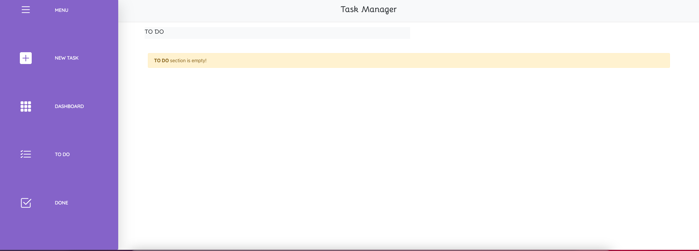

# Task Organizer Application

Welcome to our Task Organizer Application! This application is designed to enhance task organization by providing a platform where you can efficiently manage your tasks. With this application, you can easily create new tasks, track their progress, and mark them as completed.

## Features:

- **Task Creation:** Quickly create new tasks with detailed descriptions and due dates.
  
- **Task Progression:** Seamlessly track the progress of your tasks by marking them as 'In Progress' as you work on them.
  
- **Task Completion:** Once a task is finished, mark it as completed to keep your task list organized and up-to-date.

## Benefits:

- **Improved Organization:** Say goodbye to scattered to-do lists and enjoy a centralized platform to manage all your tasks.
  
- **Enhanced Productivity:** With clear visibility into your tasks' statuses, stay focused and prioritize effectively.
  
- **Effortless Collaboration:** Share tasks and collaborate with team members to accomplish goals efficiently.

Experience the convenience and efficiency of our Task Organizer Application, and take control of your tasks like never before!
